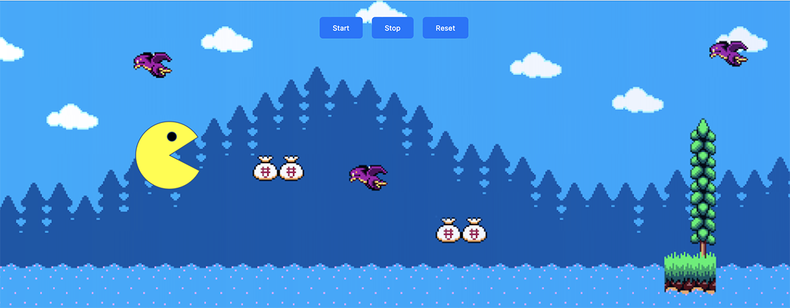

# Project for MIT xPro Full Stack Developer course

## Pac Pill Animation

This project is a simple animation of a Pac-Man-like character moving across the screen. The animation changes the character's direction when it reaches the edge of the screen.

## Features

- Smooth animation using JavaScript and CSS.
- Responsive design that works on different screen sizes.
- Control buttons to start, stop, and reset the animation.

## Files

- `pac-pills.html`: The main HTML file.
- `styles.css`: The CSS file for styling.
- `script.js`: The JavaScript file for the animation logic.

## How to run

1. Open `pac-pills.html` in a web browser.
2. Use the control buttons to start, stop, or reset the animation.
3. Preview: <a href="https://ceciliosanchez.com/github/xpro/pac_pills/pac-pills.html" target="_blank">Pac Pills</a>

## Support

Reach out at http://ceciliosanchez.com/contact/

## License

This project is licensed under the MIT License.

